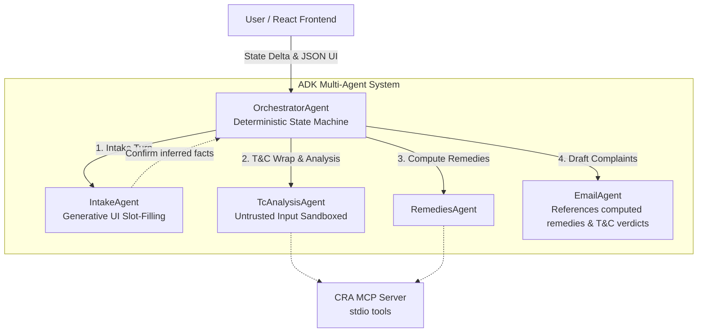

# FairClaimAI — UK Consumer Rights Agent

*Kaggle "AI Agents: Intensive Vibe Coding" capstone — Agents for Good track.*

When something you bought in the UK turns out faulty, the Consumer Rights Act 2015 is firmly
on your side — and almost nobody knows it. Sellers lean on "no refunds", "sold as seen" and
"all sales final" signs that are **legally non-binding** for faulty goods. This agent turns
*"my laptop keeps crashing and the shop says all sales are final"* into a rights-backed,
send-ready result:

1. **A clause-by-clause verdict** on the seller's terms — `BLACKLISTED` (non-binding, s.31/s.65),
   `POTENTIALLY_UNFAIR` (grey list, s.62), or `COMPLIANT` — every verdict cited and then
   reused as the seller-specific rebuttal in the complaint letter.
2. **The remedy the law actually gives you** — the s.22/s.23/s.24 ladder walked
   deterministically from your delivery date, with the correct burden of proof.
3. **A complaint email per available remedy** — cited, with any problematic T&C clause folded
   into the argument, a 14-day deadline, and escalation ladder (Section 75 / chargeback → ADR
   → Citizens Advice → small claims) in the footer.

Everything carries the disclaimer: this is general information under the CRA 2015, not
solicitor advice.

## Architecture



- **Deterministic orchestration.** The root agent is plain code, not an LLM router: intake
  runs until complete, then T&C analysis → remedies → email, each gated on its own output key
  so a failed turn resumes instead of redoing work. If the user has no terms, the T&C step is
  skipped with an explicit "statutory rights apply regardless" stub.
- **Untrusted-input security.** The active UI ingests pasted seller terms outside the model
  with size caps, regex pre-scans them for injection, wraps them in explicit delimiters, and
  analyses them with `include_contents="none"` so hostile text can't reach the conversation.
  Dormant URL/file helpers retain SSRF and content-type checks for future expansion. A
  deterministic guard strips any statutory citation outside the curated KB, and the injection
  pre-scan result is OR-ed into the output even if the model stays silent.
- **T&C analysis feeds the case, not just the dashboard.** The statutory remedy still comes
  from the CRA 2015 ladder, but blacklisted/potentially unfair clauses are passed into the
  email agent so firm/formal letters can rebut the seller's actual small print instead of using
  only generic "no refunds" language.
- **MCP server as the legal ground truth.** `src/fairclaim/backend/mcp_server/server.py` serves the curated
  CRA 2015 knowledge base as typed tools — statute summaries, blacklist clause patterns, and
  `lookup_remedy_tier`, which computes the 30-day/6-month boundaries in code (UK time, with an
  `evaluation_date` override for tests and historical cases). Because it's MCP, any client
  (Claude Desktop, another ADK app) can mount the same tools.
- **Agent skills.** The interview checklist, unfair-terms tests and remedy logic live in
  lawyer-reviewable markdown (`src/fairclaim/backend/skills/`) loaded into agent instructions — not
  hard-coded prompts.

### Models

| Tier | Model | Thinking | Used by |
| --- | --- | --- | --- |
| Fast | `gemini-3.1-flash-lite` | LOW–MEDIUM | intake, remedies |
| Capable | `gemini-3.5-flash` | MEDIUM–HIGH | T&C clause analysis, email drafting |

Override with `FAIRCLAIMAI_FAST_MODEL` / `FAIRCLAIMAI_CAPABLE_MODEL`.
Eval judging can be overridden with `FAIRCLAIMAI_JUDGE_MODEL`.

## Setup

Prereqs: Python ≥ 3.13 with [uv](https://docs.astral.sh/uv/), Node ≥ 20, a Gemini API key.

```bash
# 1. Backend (from repo root)
cp .envexample .env            # put your GEMINI_API_KEY in .env — never commit it
uv sync
PYTHONPATH=src uv run uvicorn fairclaim.backend.main:app --reload   # http://localhost:8000

# 2. Frontend
cd src/frontend
npm install
npm run dev                    # http://localhost:5173
```

The landing page's **guided demo** walks the whole experience with canned data (no backend
needed); submitting your own story runs the real live pipeline.

### Tests

```bash
uv run pytest
```

The suite pins the legal boundaries (day 30 vs 31, the six-month presumption and its
short-term-reject exception, month-end arithmetic), the citation guardrail, the injection
pre-scan, ingestion caps, and the handoff that makes T&C analysis available to email drafting.

### Regenerating the frontend types

`src/fairclaim/backend/schemas.py` is the wire contract. After changing it:

```bash
uv run python -m fairclaim.backend.scripts.gen_frontend_types
```

## Deploying (Docker / Cloud Run)

The whole app ships as **one container**: `Dockerfile` builds the frontend, then serves it as
static files from the same FastAPI process as the API (see the static mount at the bottom of
`src/fairclaim/backend/main.py`) — one origin, no CORS in production, one Cloud Run service.

**Build and run locally first:**

```bash
docker build -t fairclaimai .
docker run --rm -p 8080:8080 --env-file .env fairclaimai
# http://localhost:8080
```

**Deploy to Cloud Run** (needs `gcloud` installed and `gcloud auth login` run once, a GCP
project with billing enabled, and `.env` populated):

```bash
PROJECT_ID=your-gcp-project ./deploy/cloudrun.sh
```

This is a thin wrapper around `gcloud run deploy --source .` — Cloud Build builds the image
from the Dockerfile and pushes it, no local Docker required for this path. It also:

- stores `GEMINI_API_KEY` in **Secret Manager** (never baked into the image, never a plain
  `--set-env-vars`, never printed by the script);
- sets `--min-instances=0 --max-instances=1`. Session state is stored locally per container
  instance (not a managed database) — capping at one instance means concurrent users can never
  land on different instances and silently lose an in-progress case. The cost of that safety is
  a cold start (a few seconds) on the first request after the service scales to zero. Raise
  `--max-instances` only once sessions move to a shared store (e.g. `DatabaseSessionService`
  against Cloud SQL).
- defaults to `europe-west2` (London) — override with `REGION=...`.

Re-running the script redeploys a new revision and adds a new Secret Manager version; it's
idempotent. Region/service/secret names are overridable via env vars — see the script header.
By default it targets the existing Cloud Run service URL:
`https://fairclaimai-698454199279.europe-west2.run.app/`.

## Caveats

- Sessions are stored locally on the running container/process (ADK's default), not a managed
  database: restarting the backend, or a Cloud Run scale-to-zero cycle, orphans in-flight
  interviews (the frontend starts a fresh session per case). See the deploy section above for
  how the Cloud Run config lives with this.
- The knowledge base is a curated summary of the CRA 2015 (goods, individual buyers, UK
  traders). Services, digital content, EU and B2B purchases are out of scope — the intake
  says so honestly instead of guessing. Change-of-mind cases get signposted to the
  Consumer Contracts Regulations 2013 cooling-off where it applies.
- **Not legal advice.** For tailored advice: Citizens Advice or a solicitor.
