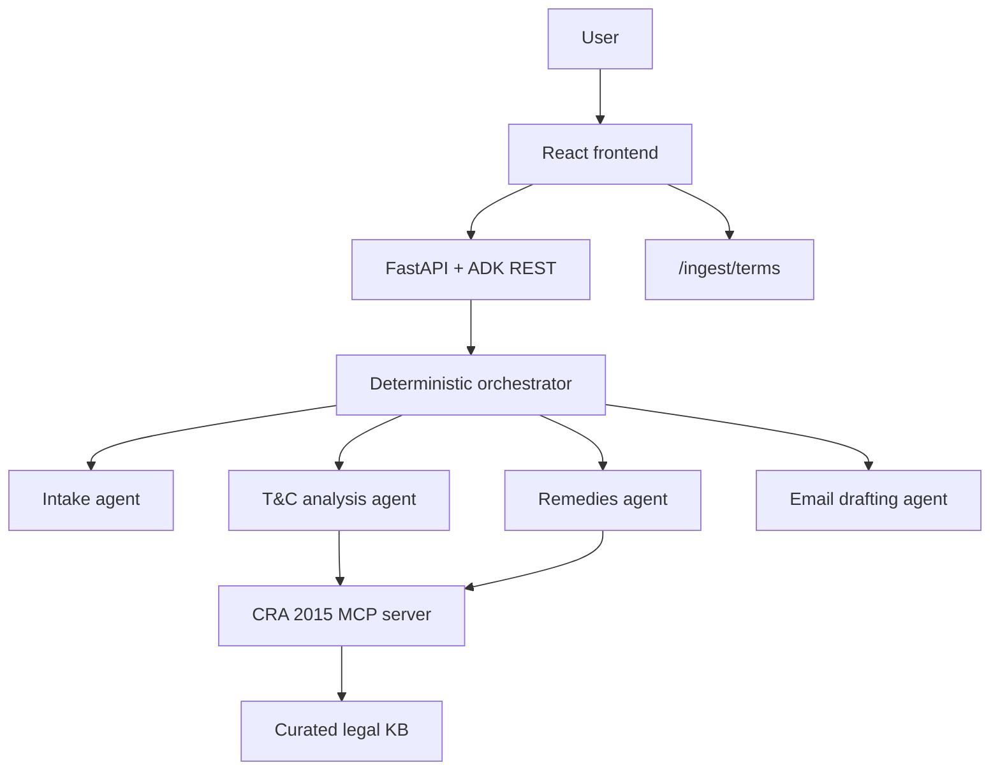

# Architecture

## System Shape



## Architectural Principles

- Deterministic orchestration owns stage order.
- LLMs write and classify where language judgment matters, but they do not compute legal deadlines or route the workflow.
- Seller terms are isolated from prior conversation and treated as untrusted evidence.
- The legal knowledge base is curated and mounted as tools.
- Pydantic schemas define the public contract.
- The frontend reads session state through ADK REST rather than a separate custom chat protocol.
- The deployed app is one origin: FastAPI API plus static built frontend.

## Runtime Flow

The root flow is:

```text
intake -> optional T&C analysis -> remedies -> email drafts
```

Detailed stage behavior:

1. Intake runs until `intake_turn.is_complete` is true or a scope gate failure exists.
2. If `is_individual` is false, orchestrator emits a scope-gate state update and stops.
3. If intake is complete but terms are neither ingested nor opted out, orchestrator stops and waits.
4. If terms are opted out, orchestrator stores an empty T&C stub and proceeds.
5. If terms are provided, orchestrator wraps them as untrusted data and runs T&C analysis.
6. Remedies run once T&C result exists or has been stubbed.
7. Email drafting runs only when remedy result exists.
8. If `email_drafts` already exists, orchestrator stops.

## State Keys

Public state keys:

- `intake_turn`
- `tc_analysis_result`
- `remedy_result`
- `email_drafts`

Private/backend state keys:

- `temp:case_fields`
- `temp:terms_wrapped`
- `temp:injection_flags`
- `temp:intake_prior_fields`
- `temp:intake_prev_component`
- `intake_confirmed_fields`
- `terms_clean`
- `terms_opted_out`

Only public keys should be documented as frontend-readable contract. The frontend may send `terms_clean` or `terms_opted_out` as `stateDelta`, but should not display private keys.

## Backend Package Responsibilities

`src/fairclaim/backend/main.py`:

- FastAPI entry point.
- Mount ADK REST routes.
- Implement `/ingest/terms`.
- Serve frontend build if present.

`src/fairclaim/backend/schemas.py`:

- Pydantic models for agent outputs and session contract.
- Source of truth for frontend generated types.

`src/fairclaim/backend/dates.py`:

- UK time helper.
- Delivery-date extraction.
- Calendar month arithmetic.

`src/fairclaim/backend/mcp_server/server.py`:

- Curated CRA 2015 tool server.
- Deterministic remedy ladder.
- Legal disclaimer.
- Clause pattern guidance.

`src/fairclaim/backend/security/`:

- Ingestion, injection scanning, untrusted wrapping, citation guardrails.

`src/fairclaim/backend/agents/`:

- Orchestrator and specialist agents.
- Intake should be a package because it contains component catalog, callbacks, and agent setup.

`src/fairclaim/backend/skills/`:

- Lawyer-reviewable prompt/skill markdown.

## Model Tiers

Use two configurable model tiers:

- Fast tier for low-risk or tool-grounded work, such as intake and remedies.
- Capable tier for judgment-heavy T&C analysis and final email drafting.

Default environment variables:

```text
FAIRCLAIMAI_FAST_MODEL=gemini-3.1-flash-lite
FAIRCLAIMAI_CAPABLE_MODEL=gemini-3.5-flash
FAIRCLAIMAI_JUDGE_MODEL=gemini-3.1-pro-preview
```

If a default model is unavailable, update `.envexample`, docs, tests, and eval config together.

## Session Storage

The MVP may use ADK local/in-memory session storage. This is acceptable for local development and a single-instance Cloud Run demo. Do not claim multi-instance persistence until a shared session store exists.

Deployment must cap Cloud Run at one instance while sessions are process-local. Raise the cap only after moving sessions to a managed shared store.

## Error Recovery

The orchestrator must be restartable from session state. Each stage should be gated on output keys:

- Missing `intake_turn` or incomplete intake: run intake.
- Missing `tc_analysis_result` when terms exist: run T&C analysis.
- Missing `remedy_result`: run remedies.
- Missing `email_drafts`: run email.

A failed model response should not force earlier completed stages to rerun on the next turn.

## API Surface

Use ADK REST for sessions and turns:

- `POST /apps/{appName}/users/{userId}/sessions/{sessionId}`
- `POST /run`
- `GET /apps/{appName}/users/{userId}/sessions/{sessionId}`

Custom endpoint:

- `POST /ingest/terms`

Production should serve frontend assets from the same FastAPI process after API routes are registered.
